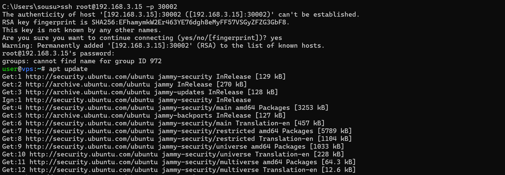
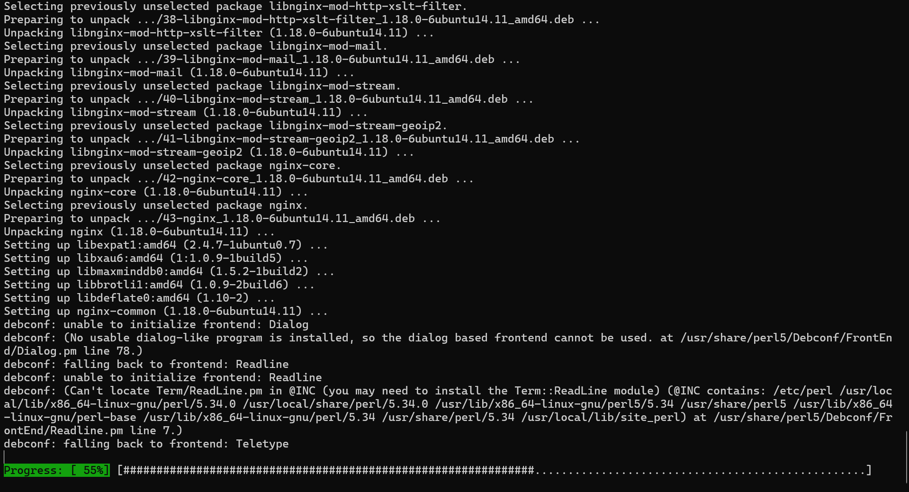
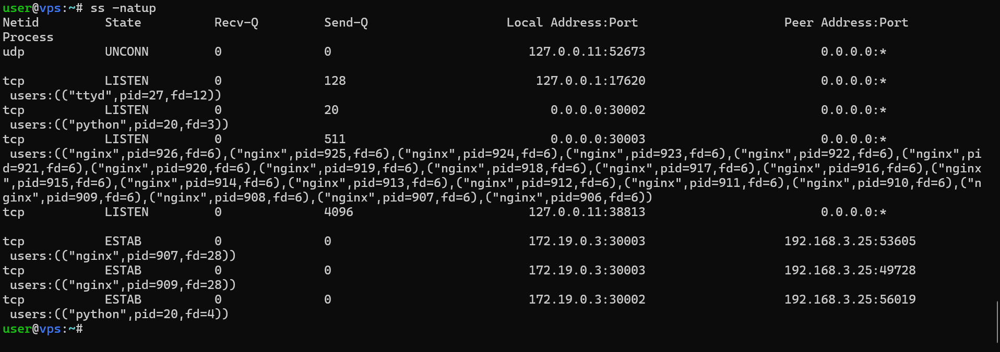
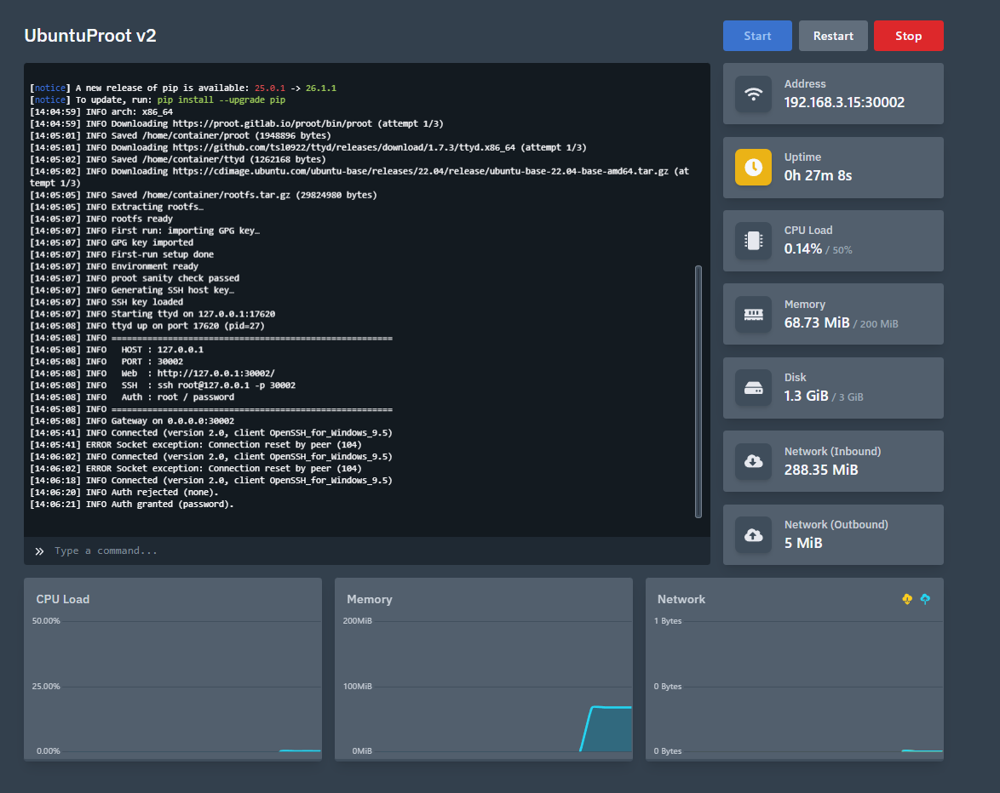

# UbuntuProot v2

rootfs不要・管理者権限不要で、SSH接続とブラウザからアクセスできるLinux環境をシングルPythonファイル1本で立ち上げるサーバーです。

PRoot（カーネルモジュール不使用のユーザーランドchroot）とttydを組み合わせ、同一ポートでSSHとHTTP（Webターミナル）を自動判別してルーティングします。Pterodactylなどroot権限のないコンテナ環境でも動作します。

---

## 動作確認







## v1からの変更点

v1は元々「自分の環境で動けばいい」程度の作りで、ポート番号・パスワード・IPアドレスがすべてコードにベタ書きされており、Ubuntuの22.04固定でした。動くには動くけど、少し条件が変わると直しが大変で、バグも複数残っていました。

v2ではその辺を全部整理しています。

### ハードコードの完全排除

v1ではポート・パスワード・ユーザー名・IPアドレスなどがすべてソースコード内に直書きされていました。v2ではCLI引数または環境変数（`.env`ファイル含む）で上書きできます。ソースを触らずに設定を変えられます。

```bash
python proot_server.py --port 22222 --ssh-user admin --ssh-pass mysecret --rootfs debian12
```

### 対応ディストリビューションの拡充

v1はUbuntu 22.04のみでした。v2では以下を引数一つで切り替えられます。

| プリセット名 | 内容 |
|---|---|
| `ubuntu22` | Ubuntu 22.04（デフォルト） |
| `ubuntu20` | Ubuntu 20.04 |
| `debian12` | Debian 12 Bookworm |
| `alpine` | Alpine Linux 3.19 |
| `local:/path/to/file.tar.gz` | ローカルのtarball |
| `https://...` | 任意のリモートURL |

### tarball展開のクラッシュ修正

v1のtarball展開コードはPython 3.12の`tarfile.data_filter`をそのまま使っていました。Ubuntu/Debianのrootfsには`etc/alternatives/awk -> /usr/bin/mawk`のような絶対パスシンボリックリンクが大量に含まれており、`data_filter`はこれを`AbsoluteLinkError`として即クラッシュさせます。

v2では独自のフィルタ関数を実装しています。絶対シンボリックリンクはproot内では正常（chroot内でのみ解決されるため）なのでそのまま通し、パストラバーサル攻撃になりうるメンバーのみをスキップします。ハードリンクの範囲外参照チェックも追加しました。

### PTYウィンドウサイズ同期の実装

v1ではPTYのウィンドウサイズがSSHクライアントの実際のサイズと同期されておらず、長文ペーストや横幅の広いターミナルで表示が崩れていました。

v2では以下の仕組みで完全に解決しています。

- SSH接続時の`pty-req`で送られてくる端末サイズ（cols/rows）を取得して`TIOCSWINSZ`で即時適用
- 接続後にターミナルをリサイズしたときの`window-change`リクエストも受け取り、動的にPTYサイズを更新
- `shopt -s checkwinsize`を`.custom_rc`に追記し、コマンド実行のたびにBashが端末サイズを再確認するように設定

### Ctrl+C / Ctrl+Z などが効かない問題の修正

v1では`subprocess.Popen(..., start_new_session=True)`で子プロセスを起動していましたが、これだと新しいセッションは作られるものの制御端末（controlling terminal）の付け直しが行われません。制御端末がない状態ではカーネルのシグナル配送機能（PTYからSIGINT/SIGTSTPを生成する仕組み）が動かないため、Ctrl+Cを押してもプロセスが止まらない状態でした。

v2では`preexec_fn`内で`os.setsid()`のあとに`TIOCSCTTY`でslave_fdを制御端末として明示的に登録しています。これでCtrl+C・Ctrl+Z・Ctrl+\などが正常に機能します。

### PS1プロンプトの表示崩れ修正

v1の`.custom_rc`に書き込むPS1にはANSIカラーコード（`\033[1;32m`など）がそのまま含まれていました。Bashはこれをreadlineのプロンプト幅計算に含めてしまうため、長いコマンドを入力すると折り返し位置がずれてプロンプトを上書きするバグがありました。

v2ではすべてのANSIエスケープを`\[`と`\]`で囲み、readlineに「この部分は表示幅ゼロ」と正しく伝えています。

### SSHネゴシエーションの競合状態修正

v1では`transport.accept()`でチャネルを取得した直後にすぐ`pty.openpty()`を呼んでいました。しかしSSHのネゴシエーションでは`pty-req`（端末サイズ情報を含む）は`shell`リクエストより前に到着するとは限りません。タイミングによってはデフォルトの80x24で`TIOCSWINSZ`が実行されたあとに実際のサイズが届くため、サイズが反映されないことがありました。

v2では`threading.Event`（`shell_requested`）を使って`check_channel_shell_request`が呼ばれるまで`pty.openpty()`の実行を待機させています。`shell`リクエストは`pty-req`のあとに来ることがSSHプロトコル上保証されているため、このタイミングで`openpty()`すれば必ず正確なサイズが取得できます。

### コードの構造改善

v1は1ファイルに関数がフラットに並んでいるだけでした。v2では責務ごとにクラスに分割されており、外部からimportして個別に使うことも可能です。

| クラス | 役割 |
|---|---|
| `ServerConfig` | 全設定の集約・解決 |
| `Downloader` | ファイル取得（リトライ付き） |
| `EnvironmentManager` | proot/ttyd/rootfsのライフサイクル管理 |
| `SSHServer` | Paramiko SSHセッション処理 |
| `TcpProxy` | 双方向TCPリレー |
| `TtydManager` | ttydプロセス起動・監視・自動再起動 |
| `L7Gateway` | プロトコル識別とルーティング |

### その他の細かい修正

- `recv(8, MSG_PEEK)`のブロッキング問題を`select()`ベースに変更。8バイト未満の到着でタイムアウトまでハングしなくなった
- セマフォの多重解放を`_ConnectionToken` RAIIクラスで完全防止
- `except Exception: pass`を全廃してすべてログ出力または`contextlib.suppress`に置き換え
- ダウンロード中に`.part`ファイルを使用し、中断時に壊れたファイルが残らないように
- `signal.SIGCHLD`の適切な設定でゾンビプロセスを防止
- tarball展開失敗時にrootfsディレクトリを自動クリーンアップ

---

## 動作要件

- Python 3.9以上（3.12推奨）
- Linux（x86_64 または aarch64/arm64）
- root権限不要
- インターネット接続（初回起動時のみ、proot/ttyd/rootfsのダウンロードに使用）

依存パッケージは`paramiko`のみです。起動時に自動でインストールされます。オプションで`python-dotenv`を入れると`.env`ファイルが使えます。

---

## 使い方

### 基本的な起動

```bash
python UbuntuProot.py
```

初回起動時にproot・ttyd・Ubuntu 22.04のrootfsを自動ダウンロードして展開します。2回目以降はキャッシュされたものを使うので即起動します。

### SSH接続

```bash
ssh root@<サーバーIP> -p 30002
```

### ブラウザからのアクセス

```
http://<サーバーIP>:30002/
```

同じポートをSSHとHTTPで共有しています。接続の最初の数バイトを見て自動で振り分けます。

### オプション一覧

```
--port            リッスンポート（デフォルト: 30002）
--ttyd-port       ttyd内部ポート（デフォルト: 17620）
--bind            バインドアドレス（デフォルト: 0.0.0.0）
--advertise-host  起動ログに表示するIP
--ssh-user        SSHユーザー名（デフォルト: root）
--ssh-pass        SSHパスワード（デフォルト: password）
--custom-user     プロンプトに表示されるユーザー名
--max-connections 最大同時接続数（デフォルト: 50）
--proxy-timeout   HTTPプロキシのタイムアウト秒数（デフォルト: 600）
--rootfs          使用するrootfs（後述）
--log-level       ログレベル DEBUG/INFO/WARNING/ERROR
```

### 環境変数での設定

すべてのオプションは対応する環境変数でも設定できます。

```
PORT=22222
SSH_USER=admin
SSH_PASS=mysecret
ROOTFS=debian12
LOG_LEVEL=DEBUG
```

`.env`ファイルに書いておくと自動で読み込まれます（`python-dotenv`が必要）。

### rootfsの指定

```bash
# プリセット使用
python UbuntuProot.py --rootfs debian12

# ローカルのtarball
python UbuntuProot.py --rootfs local:/path/to/myrootfs.tar.gz

# 任意のURL
python UbuntuProot.py --rootfs https://example.com/rootfs.tar.gz
```

---

## ファイル構成

初回起動後、スクリプトと同じディレクトリに以下が生成されます。

```
.
├── proot_server.py
├── proot          # prootバイナリ（自動ダウンロード）
├── ttyd           # ttydバイナリ（自動ダウンロード）
├── rootfs/        # Linuxルートファイルシステム（自動展開）
├── server.key     # SSH RSAホスト鍵（自動生成）
└── .custom_rc     # Bash設定ファイル
```

---

## 技術スタック

| 分類 | 内容 |
|---|---|
| 言語 | Python 3.9+ |
| SSHサーバー | [Paramiko](https://www.paramiko.org/) |
| コンテナ | [PRoot](https://proot-me.github.io/)（カーネルモジュール不要のユーザーランドchroot） |
| Webターミナル | [ttyd](https://github.com/tsl0922/ttyd) |
| L7多重化 | 自前実装（`select` + `MSG_PEEK`によるSSH/HTTP判別） |
| PTY | Python標準ライブラリ `pty` + `termios` + `fcntl`（TIOCSWINSZ/TIOCSCTTY） |
| 設定管理 | `argparse` + 環境変数 + `python-dotenv`（オプション） |
| 並行処理 | `threading`（スレッドベース、接続ごとにスレッド分離） |

---

## 注意事項

- SSH接続時に`groups: cannot find name for group ID XXXX`という警告が出ることがありますが、動作には無関係です。ホストOS側のGIDがrootfsの`/etc/group`に存在しないことで起きる表示上の問題です。
- このサーバーはproot内をrootとして動作します。公開サーバーに載せる場合は`--ssh-pass`に強いパスワードを設定し、ファイアウォールで接続元を制限してください。
- ttydのWebターミナルにはBasic認証がかかっています（SSHと同じユーザー/パスワード）。

---

## License

MIT